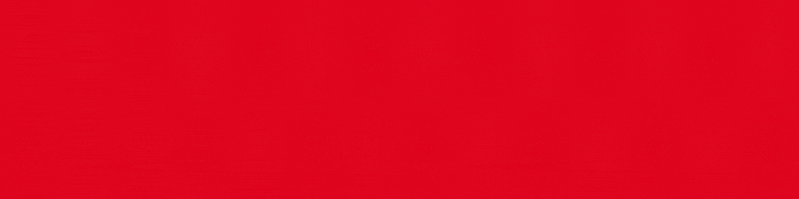

<h2 align="left">Hi 👋! I am Jackson!</h2>

###

 

  

###

<h3 align="left">Technologies I like to work</h3>

###

  
  
  
  
  
  
  
  
  

###

<h3 align="left">Want to reach me?</h3>

  

###

<h3 align="left">Some stats</h3>

 

###

<h3 align="left">See you soon🖖</h3>

###
